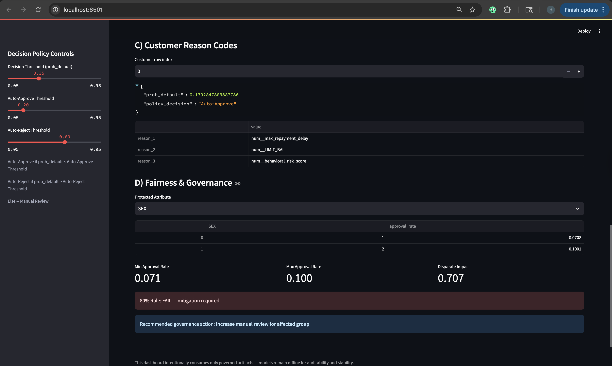

<p align="center">
  <h1 align="center">AI Decision Intelligence & Governance Platform</h1>
  <p align="center">
    A production-style AI decision governance system for regulated credit risk decisioning
  </p>
</p>

---

## 📌 Overview

In modern enterprises, **AI decisions must be explainable, auditable, and policy-controlled** — not just accurate.

This project demonstrates an **end-to-end Decision Intelligence & Governance platform** that simulates how organizations deploy AI responsibly in **regulated environments (finance, risk, compliance)**.

The system separates **model training** from **decision execution**, ensuring governance-first AI deployment.

---

##  What This Project Demonstrates

✔ **Probabilistic credit risk modeling**  
✔ **Policy-based decision thresholds** (Auto-Approve / Manual Review / Reject)  
✔ **Model explainability using SHAP reason codes**  
✔ **Fairness & bias auditing with Disparate Impact analysis**  
✔ **Governance-first deployment (models offline, artifacts only)**  
✔ **Executive-ready interactive dashboard (Streamlit)**  

---

## 📊 Dashboard Preview

This dashboard represents a **real-world executive decision system** where:
- Models are trained **offline**
- Decisions are **policy-controlled**
- Fairness & explainability are **continuously audited**
- Only **approved artifacts** are consumed in production

### Decision Intelligence Overview


### Fairness & Governance Monitoring


---

## 🧠 System Architecture

```text
notebooks/
└── 01_data_overview.ipynb        # Data exploration, training, SHAP, fairness

models/
├── credit_decision_model.joblib
└── decision_threshold.joblib

reports/artifacts/
├── decision_df.csv               # Decisions + probabilities + reason codes
├── fairness_df.csv               # Fairness metrics by protected group
├── baseline_model.joblib
└── challenger_model.joblib

dashboard/
└── app.py                        # Streamlit executive dashboard

```
---

## 📊 Dashboard Capabilities

### A) Decision Outcomes
- Auto-Approve / Manual Review / Reject counts
- Policy-driven thresholds
- Executive-level KPIs

### B) Risk Distribution
- Probability of default distribution
- Portfolio risk visibility

### C) Customer Reason Codes
- SHAP-based top drivers per decision
- Transparent, regulator-friendly explanations

### D) Fairness & Governance
- Approval rates by protected attribute
- Disparate Impact calculation
- 80% Rule compliance checks
- Automated governance recommendations

---

## 🛡️ Governance Philosophy

🚫 **No live models are served in production**

Instead:
- Models are trained **offline**
- Only **governed artifacts** are promoted
- Decisions remain **reproducible & auditable**

This mirrors **enterprise AI governance standards** used in banking, insurance, and fintech organizations.

---

## ▶️ How to Run the Dashboard

```bash
pip install -r requirements.txt
streamlit run dashboard/app.py 

```
---

📈 Why This Matters

Most AI projects focus on accuracy.

This project focuses on:
	•	Trust
	•	Transparency
	•	Accountability
	•	Regulatory readiness

Exactly what enterprises look for when deploying AI at scale.

```
👤 Author

Hiten Bahrani
Master’s in Information Systems
AI • Data • Decision Intelligence
```
